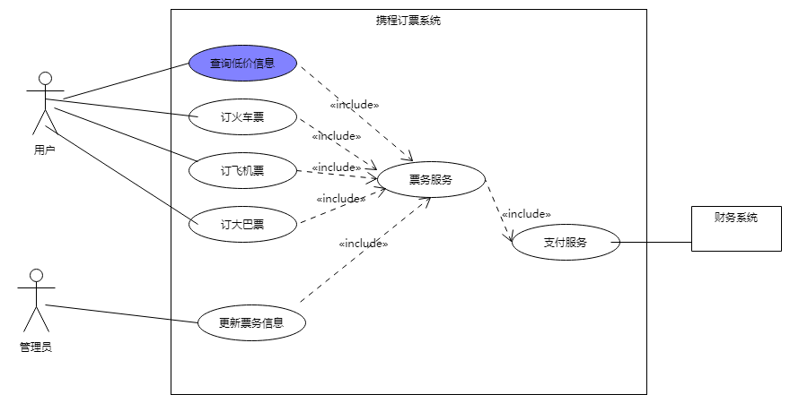
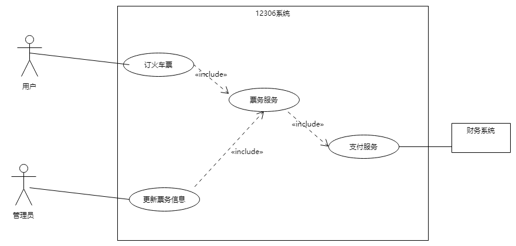

# 系统分析与测试作业四

范瑞潮 15353005

## **1、简答题**

**用例的概念**

用例是“对系统如何反应外界请求的描述，是一种通过用户的使用场景来获取需求的技术”。

**用例和场景的关系？什么是主场景或 happy path？**

每个用例提供了一个或多个场景，该场景说明了系统是如何和最终用户或其它系统互动，也就是谁可以用系统做什么，从而获得一个明确的业务目标。

每个用例中必须描述一个主场景。Happy path在测试用例中指没有出现预期之外结果的场景，在用例建模中指主成功场景中，主执行者完成了目标，所有相关人员的需求都被满足了。

**用例有哪些形式？**

用例的格式有：
* 完整正式的格式
* 非正式
* 单列表格式
* 双列表格式
* RUP格式
* 条件语句格式
* Occam格式
* 图形方式
* UML用例图

**对于复杂业务，为什么编制完整用例非常难？**

复杂业务的actors和services都很多且难以解耦，因而完整全面地规划其用例比较困难。

**什么是用例图？**

“用例图是指由参与者（Actor）、用例（Use Case），边界以及它们之间的关系构成的用于描述系统功能的视图”。

**用例图的基本符号与元素？**

系统框表示待研究的系统，小人表示参与者，椭圆形表示用例，箭头表示他们之间的交互关系。

**用例图的画法与步骤**

需求识别的步骤：确定研讨的系统 - 识别 Actors（识别主要参与者和依赖的系统） - 识别用例（服务）（识别用户级别用例和子功能级别用例） - 建立Actor和Use Cases之间的关联。

TIps：把所有的主执行者放在系统左边，支持（辅助）执行者放在系统右边。

**用例图给利益相关人与开发者的价值有哪些？**

用例图可以帮助所有开发相关人员明确项目的需求以及用户和用例之间的关系，确定用例对应的服务。

---

## **2、建模练习题（用例模型）**

 * 选择2-3个你熟悉的类似业务的在线服务系统（或移动 APP），如定旅馆（携程、去哪儿等）、定电影票、背单词APP等，分别绘制它们用例图。并满足以下要求：
    * 请使用用户的视角，描述用户目标或系统提供的服务
    * 粒度达到子用例级别，并用 include 和 exclude 关联它们
    * 请用色彩标注出你认为创新（区别于竞争对手的）用例或子用例
    * 尽可能识别外部系统和服务

* 然后，回答下列问题：
    1.  为什么相似系统的用例图是相似的？
    2.  如果是定旅馆业务，请对比 Asg_RH 用例图，简述如何利用不同时代、不同地区产品的用例图，展现、突出创新业务和技术
    3.  如何利用用例图定位创新思路（业务创新、或技术创新、或商业模式创新）在系统中的作用
    4.  请使用 SCRUM 方法，选择一个用例图，编制某定旅馆开发的需求（backlog）开发计划表
    5.  根据任务4，参考 [使用用例点估算软件成本](https://www.ibm.com/developerworks/cn/rational/edge/09/mar09/collaris_dekker/index.html)，给出项目用例点的估算

这里分析携程的订票（火车/飞机/大巴）系统与12306的订票系统。

相似系统的用户和服务也是相似的，功能相似因而用例也是相似的。

根据用例图中列出的功能可以看到哪些用例是其他系统中没有的，比如携程的低价信息功能，以此强化对这个用例的开发。

携程订票系统的用例估算：

| 用例名称 | 事务 | 计算 | 备注 |
| --- | --- | --- | --- |
| 订火车票 | 2 | 1 | 订票界面遵循框架 |
| 订飞机票 | 2 | 1 | 同上 |
| 订大巴票 | 2 | 1 | 同上 |
| 管理票务 | 3 | 2 |     |
| 票务系统 | 8 | 8 | 庞大 |
| 支付(调用支付系统) |  5   |   5  |   安全问题  |
